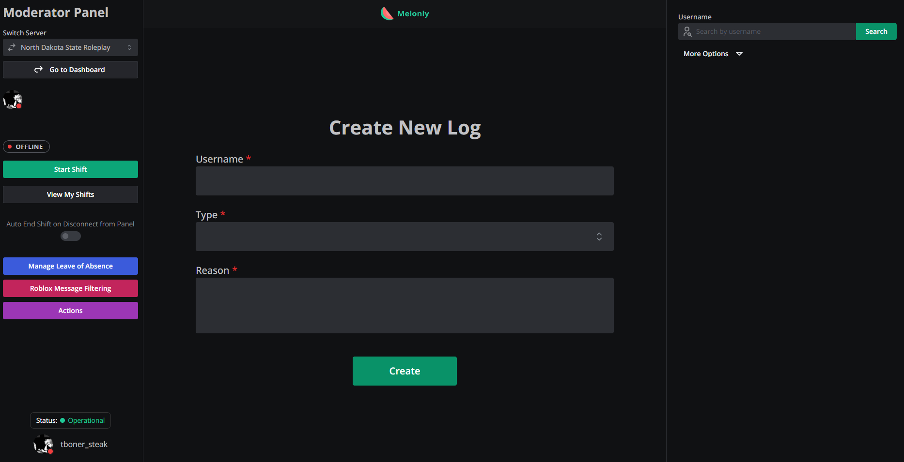

# Melonly Guide

## Why we use Melonly:

We use Melonly for a multitude of reasons. The first, we can keep track of who did what. Melonly is a logging system, so we can know who took action, and if it was proper. Second of all, we can keep track of your shifts. When going on duty, you must start a shift, so we can keep track, and see if you reach your quota. It is mandatory you go on/off shift when needed.

## How to get access to Melonly:

When in Melonly, you must be accepted into the staff panel. To do so, head to [melonly.xyz](https://melonly.xyz) and click "Get Started". Then, click "Join A Server". Then, type the code "ZVVOBR". After that, message or ping a HR+ to accept you into the Melonly panel. After completed, you now have access to Melonly!

## What do I do?

<figure><figcaption>
Melonly Moderator Panel:
</figcaption></figure>

Once accepted, you will see the staff panel, which should look something like the image above. Everything is labeled, and easy to use.&#x20;

**Logging:** In the middle of the screen, you see the Logging section. Every time you do an action, it is **MANDATORY** you log it. Enter their username, what you did, and why. If found not logging, you will be infracted.

**Shifts:** To know when you are on or off duty, you must start your shift. To start your shift, click the "Start Shift" button on the side of the screen. This will then give you a Discord role that you are currently moderating, and, we will know if you hit your quota.

**LOAs:** LOA stands for "Leave Of Absence". If for any reason you will be gone and can not hit your quota, please fill out a LOA immediatley. This will then tell us that you will not have to hit your quota for the week(s).

## What is a ban bolo?

A ban bolo is something for users that are below admin. Since you cannot ban, you must file a Ban Bolo. This will tell a admin to ban the user for you.
