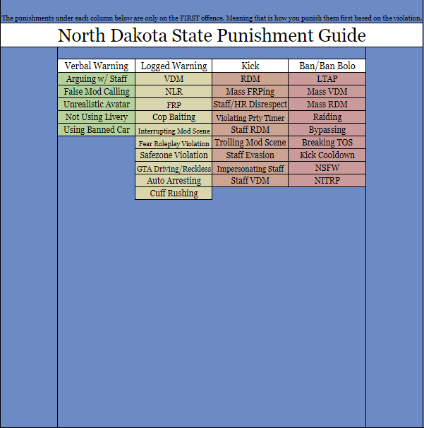

# Punishment Guide

The Staff Team has put together a helpful Punishment Guide, aimed at ensuring fairness and order within our server's roleplay community. This guide serves as a reference for our staff members to know how to handle instances when individuals don't abide by our established rules and agreements.

If you need to refer to the guide or access the spreadsheet listing all violations and their corresponding punishments, you can find the link provided either above or below.

Please take note of the following important points:

1. Adhering to the Punishment Guide is crucial for maintaining a balanced and enjoyable environment. Failing to apply the correct punishment may result in receiving an infraction for staff members.
2. It's essential to log all issued punishments accurately. Neglecting to do so may lead to an infraction.
3. If a player repeats the same violation multiple times, it will be promptly escalated to the next appropriate category of punishment. For example, a VDM violation starts with a warning on the first offense, but if repeated, a kick would be appropriate.
4. The punishments assigned to users should be reset at a certain point, but this is ultimately left to the staff's discretion and judgment. For instance, if a player receives a warning for VDM and then commits the same violation the next day, a second warning is more appropriate than an immediate kick.

We believe in a fair and compassionate approach to maintain a positive community, and we trust our staff members to use their best judgment in applying these guidelines. Thank you for your dedication to ensuring a great roleplaying experience for all!

<figure><figcaption></figcaption></figure>
