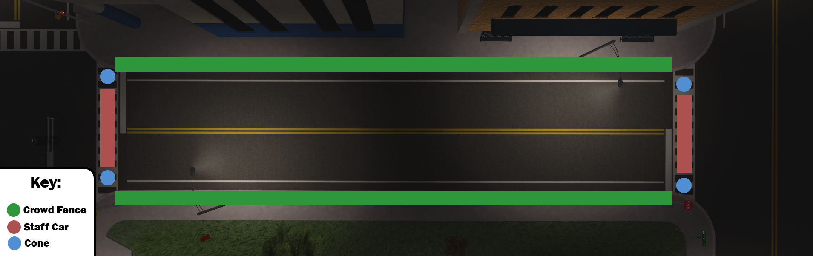

# STS Guide

<figure><figcaption>
Shoulder To Shoulder Layout
</figcaption></figure>

## Information:

The image above depicts how the shoulder to shoulder should be setup every time. Failure to do so will result in moderation. You will need at least 3 staff members on duty, and you must get permission from HR+ to host a STS. **YOU SHOULD ONLY HOST A STS IF THE SERVER IS OUT OF HAND. THIS IS A LAST RESORT OPTION AFTER PRIORITY.**

* The individual in charge of hosting must be the one responsible for positioning the cones and fences, ensuring that objects remain undisturbed during loading.
* While hosting, this person should be stationed on the sidewalk, while the other 2+ individuals supervise the members, ensuring compliance with the rules.
* The host's main focus should be on conveying load and bring messages, as well as using the :m commands. They should avoid engaging in activities like kicking or reprimanding others to stop talking.
*   To be eligible for hosting, the individual must possess the capability to switch between tabs and copy & paste messages. Without this ability, they cannot fulfill the role of the host.

## Starting STS (For Host Only):

About 5 minutes before you plan to bring all, send this message.

`:h Attention! Conclude your roleplays as an STS event is about to start! Ensure you are ready for teleportation.`

Then, after roughly 5 minutes, run a few commands.&#x20;

`:load others` _(run 2-3 times to ensure every player is accounted for, make sure the user hosting the STS runs this, or the cones and walls will be deleted)_

`:bring others` _(run 2-3 times to ensure every player is accounted for)_

## Getting Players to where they need to be (For Host Only):

After teleportation, make sure all staff are nearby you, then the host will run the command `:m ⚠️Please line up on the yellow line. Failure to do so will result in a kick.` After you run the command, if anyone does not line up, you ask them twice or three times to get on the yellow line, if they do not follow instructions, kick them. **DO NOT FORGET TO LOG IT INSIDE OF MELONY.**

## Messages (For Host Only):

After everything is setup, we will now go over the rules of the game. Please copy and paste each message roughly 10 seconds apart to ensure every member has read the message. Make sure to copy and paste these messages exactly, as these have been tested from Roblox censorship.

`:m Fail Roleplay: Fail Roleplay is not permitted, this is when a player fails to Roleplay realistically. This will result in a logged warning.`

`:m Fear Roleplay: Fear Roleplay is that when a user is being threatened or in danger. They must follow the commands of the user threatening them. You must act fearful. Failure to do so will result in a logged warning.`

`:m Cuff Rushing: When cuffing a player, you must use motion. Ex, "-cuffs-" or "-arrests-". Using motion is required in all situations when you cuff someone. Failure to do so will result in a logged warning.`

`:m Random Death Match: Random Death Match, or, R-D-M, is when a user randomly kills another user during no roleplay both users are in. Doing so will result in a kick.`

`:m Vehicle Death Match: Vehicle Death Match is the action when a user randomly rams into or damages another member's car with no reason during no roleplay. Doing so will result in a logged warning.`

`:m Priority Timers: During priority timers, you must not commit any major crimes or do any major scenes/roleplays. Failure to abide the priority will result in a kick.`

`:m Provided Items: You are required to use our provided livery's & uniforms while you roleplay in our server. Failure to do so will result in a verbal warning.`

`:m Common Sense: Don't do anything you think will get you banned or troll. Use your common sense to determine if what you are doing is allowed, even if it's not listed in the rules.`

`:m TOS: You must follow the Roblox TOS at ALL times. Failure to do so will most likely result in a ban.`

## After STS

That will conclude the rules section, then, you will do a avatar check. All staff will go around and check if the avatars are realistic. If not, ask them to change it and refresh them. Failure to comply will result in a kick. **DO NOT FORGET TO LOG IT INSIDE OF MELONY.** To inform them about this, make sure the leader sends `:m ✅ That concludes the rules section of the STS. Please wait patiently as we check if your avatar is realistic.`

Finally, we will do a discord check. The host will send the message `:m✔️ We are almost complete with the STS, please standby whilst we do a dizzy check. Please be prepared to ping the staff that comes by you.` If a user does not ping you, or states they're not inside of the discord, tell them `Please join by using the following code -> .gg/sRymWkacaX` If they cannot or do not join, kick them. **DO NOT FORGET TO LOG IT INSIDE OF MELONY.**

## Concluding STS:

Finally, after all of that, we can conclude the STS. Please have the host send the message `:m ✅We are complete with the STS. Please continue roleplay, you are dismissed.` Remove the staff vehicles, cones, and fences, and resume normal roleplay.

